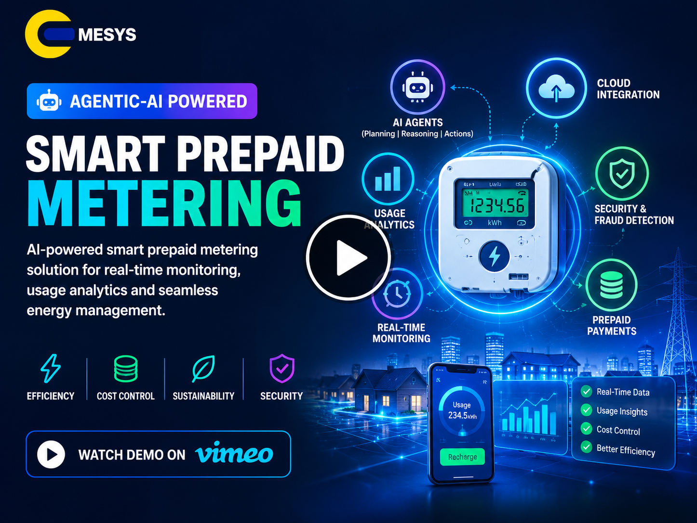

# ⚡ AI & Agentic-AI Powered Cloud Smart & Prepaid Metering Software Solution

> **Intelligent Cloud-Native Smart Metering, Prepaid Energy Management &
> Autonomous Utility Operations**

> An enterprise software solution combining cloud-native microservices,
> real-time smart-meter telemetry, prepaid ledger management, Agentic AI
> workflows, predictive machine learning, and consumer energy
> intelligence for modern utility operations.

------------------------------------------------------------------------


<p align="center">


</p>


------------------------------------------------------------------------

## ⚡ Important

> This project is an **enterprise technical proposal and software
> architecture** for AI-powered smart/prepaid metering. Production
> deployment requires validation of meter protocols, utility
> regulations, cybersecurity controls, AI guardrails, financial
> controls, and operational performance through pilot testing.

------------------------------------------------------------------------

# 📑 Table of Contents

-   [Project Overview](#-project-overview)
-   [Problem Statement](#-problem-statement)
-   [Project Objectives](#-project-objectives)
-   [Our Solution](#-our-solution)
-   [Key Features](#-key-features)
-   [Smart Metering Ecosystem](#-smart-metering-ecosystem)
-   [Agentic AI](#-agentic-ai)
-   [Predictive ML Analytics](#-predictive-ml-analytics)
-   [Prepaid & Billing Engine](#-prepaid--billing-engine)
-   [System Workflow](#-system-workflow)
-   [Technology Stack](#-technology-stack)
-   [Project Architecture](#-project-architecture)
-   [Risk Assessment](#-risk-assessment)
-   [Expected Business Value](#-expected-business-value)
-   [Project Screenshots](#-project-screenshots)
-   [Project Demo](#-project-demo)
-   [Results & Validation](#-results--validation)
-   [Future Scope](#-future-scope)
-   [Project Takeaway](#-project-takeaway)
-   [Project Team](#-project-team)
-   [License](#-license)

------------------------------------------------------------------------

# ⚡ Project Overview

**AI & Agentic-AI Powered Cloud Smart / Prepaid Metering Software
Solution** is an enterprise-oriented cloud software platform designed to
modernize traditional utility metering, billing, revenue collection, and
customer-service operations.

Traditional utility infrastructures can experience:

-   High aggregate technical and commercial (AT&C) losses
-   Manual disconnection and reconnection processes
-   Billing and collection delays
-   Limited real-time consumption visibility
-   Reactive customer support
-   Difficulty identifying electricity theft and meter tampering
-   Limited predictive visibility into grid and transformer conditions

The completed platform combines **smart metering, cloud computing,
event-driven architecture, prepaid accounting, Agentic AI, and machine
learning** to create an intelligent utility operating environment.

### The platform provides:

-   Real-time smart-meter telemetry
-   Cloud HES and MDMS
-   Prepaid token and balance management
-   Real-time billing and tariff processing
-   Payment gateway integration
-   Autonomous AI-assisted operations
-   Customer-service automation
-   Debt recovery workflows
-   Fraud and NTL detection
-   Load forecasting
-   Transformer overload prediction
-   Consumer energy insights
-   Web/mobile utility interfaces

------------------------------------------------------------------------

# 🚩 Problem Statement

Traditional metering and billing systems are often designed around
periodic data collection and manual operational processes.

This can result in:

-   Billing lag
-   Delayed revenue collection
-   Manual customer-service operations
-   Slow dispute resolution
-   Limited visibility into electricity consumption
-   Delayed identification of theft/tampering
-   Reactive transformer and grid monitoring
-   Network connectivity challenges in remote areas

### Major Challenges

-   💰 Revenue collection delays
-   ⚡ High AT&C losses
-   🔌 Manual disconnect/reconnect operations
-   🕵️ Non-technical losses and electricity theft
-   📊 Limited real-time telemetry intelligence
-   🤖 Lack of autonomous operational workflows
-   📞 High customer-service workload
-   🔥 Transformer overload risk
-   📡 Cellular/IoT connectivity outages
-   ⚠️ AI hallucination risk in sensitive billing workflows

The completed solution addresses these challenges through a
cloud-native, event-driven, AI-enabled architecture.

------------------------------------------------------------------------

# 🎯 Project Objectives

The project focuses on three primary objectives.

## 01. Autonomous Revenue Protection

Transition utilities toward a highly automated prepaid and
smart-metering ecosystem.

The objective is to:

-   Reduce billing lag
-   Automate prepaid collection
-   Accelerate revenue realization
-   Automate low-balance notifications
-   Support controlled disconnect/reconnect workflows

------------------------------------------------------------------------

## 02. Agentic Operational Efficiency

Use Agentic AI workflows to assist with complex utility operations.

Potential workflows include:

-   Tariff anomaly investigation
-   Billing dispute assistance
-   Customer support
-   Debt recovery
-   Demand-response directives
-   Operational investigation

------------------------------------------------------------------------

## 03. Proactive Grid Intelligence

Use real-time telemetry and ML analytics to identify:

-   Grid loading conditions
-   Non-technical losses
-   Meter tampering
-   Electricity theft indicators
-   Abnormal consumption
-   Transformer overload conditions

------------------------------------------------------------------------

# 💡 Our Solution

The project combines **cloud-native software, IoT smart metering, event
streaming, prepaid accounting, Agentic AI, and predictive analytics**.

### Core Workflow

``` text
                    SMART METERS
                         │
                         ▼
              DLMS / MQTT / IoT Gateway
                         │
                         ▼
                 Apache Kafka
                         │
            ┌────────────┴────────────┐
            │                         │
            ▼                         ▼
       Cloud MDMS              Agentic AI Engine
            │                         │
            ▼                         ▼
    Prepaid & Billing        AI Operational Workflows
            │                         │
            └────────────┬────────────┘
                         │
                         ▼
                 ML Analytics
                         │
          ┌──────────────┼──────────────┐
          ▼              ▼              ▼
      Load Forecast   NTL Detection   Transformer
                                       Health
          │              │              │
          └──────────────┼──────────────┘
                         ▼
              Utility & Consumer Portal
```

The architecture is designed to process high-volume telemetry while
supporting automated operational workflows.

------------------------------------------------------------------------

# 🚀 Key Features

## ⚡ Real-Time Prepaid Management

The platform provides:

-   Real-time prepaid balance monitoring
-   Automated token generation
-   Low-balance warnings
-   Top-up processing
-   Automated disconnect commands
-   Automated reconnect commands
-   Flexible tiered tariffs
-   Prepaid accounting

The proposed prepaid engine uses a **real-time double-entry ledger
approach** and targets sub-second token-generation workflows.

------------------------------------------------------------------------

## 🤖 Agentic Customer Support

AI agents can assist with:

-   Customer inquiries
-   Itemized bill explanations
-   Billing disputes
-   Payment-plan workflows
-   Debt recovery
-   Automated notifications

The agentic system is designed to interact with utility databases and
business services while operating within defined permissions and
guardrails.

------------------------------------------------------------------------

## 🕵️ Non-Technical Loss Detection

Machine-learning analytics can compare feeder-level energy input against
aggregated consumer consumption.

``` text
Feeder Meter
     │
     ▼
Energy Input
     │
     ├─────────────────────┐
     │                     │
     ▼                     ▼
Consumer Meter A      Consumer Meter B
     │                     │
     └──────────┬──────────┘
                ▼
       Aggregated Consumption
                │
                ▼
        Energy Balance Check
                │
                ▼
       ML Anomaly Detection
                │
                ▼
       Potential NTL Indicator
                │
                ▼
       Investigation Workflow
```

Potential indicators include:

-   Meter bypass
-   Tampering
-   Abnormal consumption
-   Feeder-level imbalance
-   Localized energy-loss patterns

------------------------------------------------------------------------

## 📈 Predictive Grid Intelligence

The ML layer supports:

-   Load forecasting
-   Consumption anomaly detection
-   Tamper/bypass identification
-   Transformer overload prediction
-   Grid loading analysis

------------------------------------------------------------------------

## 📱 Consumer Energy Portal

Consumers can be provided with:

-   Real-time energy usage
-   Prepaid balance
-   Cost projections
-   Usage trends
-   Top-up functionality
-   Energy-saving recommendations
-   Notifications
-   Consumer support

------------------------------------------------------------------------

# 📡 Smart Metering Ecosystem

The platform integrates with multiple smart-meter communication
technologies.

  Technology   Role
  ------------ ---------------------------------------------
  DLMS/COSEM   Smart-meter communication and data exchange
  MQTT         IoT messaging
  NB-IoT       Cellular IoT connectivity
  4G           Cellular smart-meter communication
  RF Mesh      Local smart-meter networking
  HES          Head-End System
  Kafka        High-throughput event streaming

### Meter-to-Cloud Flow

``` text
+---------------------+
|     Smart Meter     |
+----------+----------+
           |
           | DLMS / MQTT
           v
+---------------------+
| IoT Gateway / HES   |
+----------+----------+
           |
           v
+---------------------+
| Apache Kafka        |
| Event Streaming     |
+----------+----------+
           |
           v
+---------------------+
| Cloud MDMS          |
+---------------------+
```

------------------------------------------------------------------------

# 🤖 Agentic AI

The project implements an autonomous multi-agent architecture using
frameworks such as **CrewAI** or **LangGraph**.

### Agentic AI Components

``` text
                  +-----------------------+
                  |   Agentic AI Engine   |
                  +-----------+-----------+
                              │
          ┌───────────────────┼───────────────────┐
          │                   │                   │
          ▼                   ▼                   ▼
+----------------+   +----------------+   +----------------+
| Customer       |   | Billing /      |   | Fraud / NTL    |
| Support Agent  |   | Dispute Agent  |   | Investigation  |
+----------------+   +----------------+   +----------------+
          │                   │                   │
          └───────────────────┼───────────────────┘
                              │
                              ▼
                    Utility Core Services
```

------------------------------------------------------------------------

## 👤 Customer Support Agent

``` text
Customer Query
      │
      ▼
Identify Intent
      │
      ▼
Retrieve Account Data
      │
      ▼
Analyze Request
      │
      ▼
Generate Response
      │
      ▼
Resolve / Escalate
```

------------------------------------------------------------------------

## 💳 Billing Dispute Agent

``` text
Billing Dispute
      │
      ▼
Retrieve Billing History
      │
      ▼
Check Meter Data
      │
      ▼
Check Tariff Application
      │
      ▼
Prepare Resolution
      │
      ▼
Verification / Approval
```

------------------------------------------------------------------------

## 💰 Debt Recovery Agent

``` text
Outstanding Balance
      │
      ▼
Customer Profile
      │
      ▼
Payment History
      │
      ▼
Generate Structured Payment Plan
      │
      ▼
Customer Notification
```

------------------------------------------------------------------------

## 🛡️ Agentic AI Guardrails

Because billing and financial systems are sensitive, AI agents should
not be allowed to independently modify critical financial records
without verification.

``` text
AI Agent
   │
   ▼
Retrieve Data
   │
   ▼
Reason / Analyze
   │
   ▼
Propose Action
   │
   ▼
Deterministic Business Rules
   │
   ▼
Verification
   │
   ▼
Financial / Operational Action
```

------------------------------------------------------------------------

# 🧠 Predictive ML Analytics

The ML layer provides proactive utility intelligence.

## 🔮 Load Forecasting

Historical and real-time consumption telemetry can be used to analyze:

-   Demand patterns
-   Peak load
-   Consumer demand
-   Feeder demand
-   Future consumption trends

------------------------------------------------------------------------

## 🚨 Anomaly Detection

ML models can identify:

-   Sudden consumption changes
-   Abnormal meter behavior
-   Unexpected load patterns
-   Potential tampering
-   Energy imbalance

------------------------------------------------------------------------

## 🔥 Transformer Health

Predictive analytics can provide early warnings for:

-   Transformer overloading
-   Abnormal load conditions
-   Potential operational stress

------------------------------------------------------------------------

# 💳 Prepaid & Billing Engine

The prepaid engine is one of the core components of the platform.

``` text
+-----------------------+
| Consumer Account      |
+-----------+-----------+
            │
            ▼
+-----------------------+
| Tariff Engine         |
+-----------+-----------+
            │
            ▼
+-----------------------+
| Prepaid Ledger        |
| Double-Entry Model    |
+-----------+-----------+
            │
      ┌─────┼─────────────┐
      │     │             │
      ▼     ▼             ▼
    Token  Balance      Payment
   Generate Update      Reconcile
      │     │             │
      └─────┼─────────────┘
            ▼
+-----------------------+
| Meter Command Engine  |
+-----------+-----------+
            │
       ┌────┴────┐
       ▼         ▼
  Disconnect  Reconnect
```

### Core Capabilities

-   Prepaid balance management
-   Token generation
-   Payment/top-up processing
-   Tariff calculation
-   Double-entry accounting
-   Low-balance thresholds
-   Disconnect/reconnect workflows
-   Payment reconciliation

------------------------------------------------------------------------

# 🔄 System Workflow

``` text
                    USER / UTILITY
                         │
                         ▼
                +-------------------+
                | Smart Meter / App |
                +---------+---------+
                          │
                          ▼
                +-------------------+
                | HES / IoT Gateway |
                +---------+---------+
                          │
                          ▼
                +-------------------+
                | Apache Kafka      |
                +---------+---------+
                          │
             ┌────────────┼────────────┐
             │            │            │
             ▼            ▼            ▼
           MDMS        Prepaid      AI / ML
             │         Ledger       Analytics
             │            │            │
             └────────────┼────────────┘
                          │
                          ▼
                +-------------------+
                | Utility Services  |
                +---------+---------+
                          │
             ┌────────────┼────────────┐
             ▼            ▼            ▼
       Utility Portal  Consumer     Notifications
                       Portal
```

------------------------------------------------------------------------

# 🛠 Technology Stack

### Cloud & Infrastructure

-   Cloud-native microservices
-   Kubernetes
-   Docker
-   Multi-tenant architecture

### Messaging & Event Streaming

-   Apache Kafka
-   MQTT

### Smart Metering

-   DLMS/COSEM
-   NB-IoT
-   4G
-   RF Mesh
-   HES

### Artificial Intelligence

-   Agentic AI
-   LLM-based agents
-   CrewAI
-   LangGraph

### Machine Learning

-   Deep learning pipelines
-   Load forecasting
-   Anomaly detection
-   NTL detection
-   Transformer analytics

### Data & Performance

-   Cloud MDMS
-   Redis
-   Real-time prepaid ledger
-   Distributed event processing

### Application Layer

-   REST/API integration
-   Consumer web portal
-   Utility operations portal
-   Mobile applications

------------------------------------------------------------------------

# 🏗 Project Architecture

``` text
                         SMART METERS
                              │
                              ▼
                   +----------------------+
                   | DLMS / MQTT / HES    |
                   | IoT Gateway Layer    |
                   +----------+-----------+
                              │
                              ▼
                   +----------------------+
                   |    Apache Kafka      |
                   |   Event Streaming    |
                   +----------+-----------+
                              │
             +----------------+----------------+
             │                                 │
             ▼                                 ▼
+--------------------------+       +--------------------------+
| Cloud MDM / MDMS         |       | Agentic AI Workflow      |
| Meter Data Management    |<----->| Engine                   |
+------------+-------------+       +------------+-------------+
             │                                  │
             ▼                                  ▼
+--------------------------+       +--------------------------+
| Prepaid Ledger & Billing |       | Predictive ML Analytics  |
| Tariffs / Tokens / Debt  |       | Forecast / NTL / Health  |
+------------+-------------+       +------------+-------------+
             │                                  │
             +----------------+-----------------+
                              │
                              ▼
                +-------------------------------+
                | Consumer & Utility Portals    |
                | Web / Mobile / Operations     |
                +-------------------------------+
```

------------------------------------------------------------------------

# ☁️ Cloud Deployment Architecture

The platform supports deployment on a multi-tenant Kubernetes
environment.

``` text
                 INTERNET / PRIVATE NETWORK
                           │
                           ▼
                  +-------------------+
                  | API Gateway / WAF |
                  +---------+---------+
                            │
       ┌────────────────────┼────────────────────┐
       │                    │                    │
       ▼                    ▼                    ▼
+--------------+    +--------------+    +--------------+
| HES Service  |    | MDMS Service  |    | AI Gateway   |
+------+-------+    +------+-------+    +------+-------+
       │                   │                   │
       └───────────────────┼───────────────────┘
                           ▼
                  +-------------------+
                  | Apache Kafka      |
                  +---------+---------+
                            │
       ┌────────────────────┼────────────────────┐
       │                    │                    │
       ▼                    ▼                    ▼
+--------------+    +--------------+    +--------------+
| Prepaid      |    | ML Analytics |    | Agentic AI  |
| Ledger       |    | Services     |    | Workflows   |
+------+-------+    +------+-------+    +------+-------+
       │                   │                   │
       └───────────────────┼───────────────────┘
                           ▼
                  +-------------------+
                  | Database / Redis  |
                  +---------+---------+
                            │
                            ▼
                  +-------------------+
                  | Web / Mobile Apps |
                  +-------------------+
```

------------------------------------------------------------------------

# ⚠️ Risk Assessment

  ----------------------------------------------------------------------
  Risk             Impact           Probability      Mitigation
  ---------------- ---------------- ---------------- -------------------
  Cellular / IoT   High             Medium           Edge caching and
  network outages                                    store-and-forward
                                                     telemetry

  Agentic AI       High             Low              Deterministic
  hallucination in                                   guardrails and
  billing disputes                                   verified financial
                                                     actions

  High concurrency Medium           Medium           Kubernetes
  during token                                       autoscaling and
  top-ups                                            Redis caching
  ----------------------------------------------------------------------

------------------------------------------------------------------------

## 📡 Network Outage Mitigation

Remote smart meters may experience connectivity interruptions.

The implemented approach is:

``` text
Smart Meter
    │
    ▼
Local Edge Cache
    │
    ├── Network Available ──> Cloud
    │
    └── Network Unavailable
             │
             ▼
       Store Telemetry
             │
             ▼
      Network Restored
             │
             ▼
        Upload Data
```

------------------------------------------------------------------------

## 🤖 AI Hallucination Mitigation

Agentic AI should operate under strict deterministic controls.

``` text
AI Proposal
     │
     ▼
Business Rules
     │
     ▼
Verification
     │
     ▼
Authorized Action
```

Financial ledger updates require additional verification rather than
direct autonomous modification.

------------------------------------------------------------------------

## 🚀 High-Concurrency Mitigation

Token top-up peaks can be handled through:

-   Kubernetes autoscaling
-   Distributed Redis caching
-   Event-driven processing
-   Scalable prepaid services

------------------------------------------------------------------------

# 📊 Business Value & Intended Outcomes

The project architecture and solution capabilities support several
intended business outcomes.

## 💰 Revenue Recovery & Cash Flow

The proposal estimates that elimination of credit collection delays and
reduction of non-technical losses could improve utility cash flow by
**15--25% within the first year**, subject to actual deployment and
validation.

------------------------------------------------------------------------

## 🧑‍💼 Operational Cost Reduction

Automation of routine customer service, billing disputes, and meter
provisioning is projected to reduce operational overhead by **up to
40%**, subject to implementation and adoption.

------------------------------------------------------------------------

## ⚡ Grid Reliability

Real-time grid visibility and automated outage detection are expected to
support improvements in:

-   SAIDI
-   SAIFI
-   Grid monitoring
-   Operational response

------------------------------------------------------------------------

## 😊 Customer Satisfaction

The platform is designed to improve customer experience through:

-   Real-time energy visibility
-   Faster customer support
-   Prepaid transparency
-   Automated notifications
-   Personalized energy recommendations

------------------------------------------------------------------------

# ✅ Completed Solution Components

The completed solution brings together the major functional and
architectural building blocks required for intelligent smart and prepaid
utility metering.

  -----------------------------------------------------------------------
  Component                           Completed Capability
  ----------------------------------- -----------------------------------
  Smart Metering                      DLMS/COSEM, MQTT, NB-IoT/4G and RF
                                      Mesh integration concepts

  HES / MDMS                          Meter telemetry ingestion,
                                      management and centralized data
                                      services

  Event Streaming                     Kafka-based real-time telemetry and
                                      event processing

  Prepaid Engine                      Real-time balance, token, tariff
                                      and ledger management

  Billing & Payments                  Billing workflows, payment
                                      integration and reconciliation

  Agentic AI                          Customer support, billing-dispute,
                                      debt-recovery and operational
                                      workflows

  Predictive ML                       Load forecasting, anomaly
                                      detection, NTL indicators and
                                      transformer analytics

  Consumer Experience                 Usage visibility, cost projections,
                                      notifications and energy
                                      recommendations

  Utility Operations                  Centralized monitoring, alerts and
                                      AI-assisted operational
                                      intelligence

  Security & Governance               Guardrails, verification,
                                      authorization and audit-oriented
                                      controls
  -----------------------------------------------------------------------

### Completed Capability Flow

``` text
                    COMPLETED PLATFORM
                           │
       ┌───────────────────┼───────────────────┐
       ▼                   ▼                   ▼
 Smart Metering       Prepaid & Billing   Agentic AI
       │                   │                   │
       └───────────────────┼───────────────────┘
                           ▼
                  Predictive ML Analytics
                           │
             ┌─────────────┼─────────────┐
             ▼             ▼             ▼
          Revenue        Grid          Consumer
         Protection   Intelligence    Experience
             │             │             │
             └─────────────┼─────────────┘
                           ▼
                 Intelligent Utility
                     Operations
```


# 📷 Project Screenshots


## 🖥️ Utility Operations Dashboard

<p align="center">


</p>


------------------------------------------------------------------------

## 💳 Prepaid Metering Dashboard

<p align="center">


</p>


------------------------------------------------------------------------

## 🤖 Agentic AI Operations

<p align="center">


</p>


------------------------------------------------------------------------

## 📱 Consumer Energy Portal


<p align="center">


</p>


------------------------------------------------------------------------

# 🎥 Project Demo


<p align="center">

<a href="https://vimeo.com/1233269166">

</a>


</p>


<p align="center">

▶️ **Click the thumbnail to watch the project demo**


</p>


------------------------------------------------------------------------

# 📈 Results & Validation

The current project is presented as an **enterprise technical proposal
and architecture**, rather than a completed production deployment.

Therefore, final production metrics should be established during:

-   Sandbox testing
-   Integration testing
-   AI/ML validation
-   Load testing
-   Security testing
-   Smart-meter pilot deployment
-   Commercial rollout

### Recommended Validation Metrics

  Area               Metrics
  ------------------ ------------------------------------------------------
  Meter Telemetry    Events/sec, ingestion latency
  Prepaid            Token-generation latency, transaction success
  AI Agents          Resolution rate, escalation rate, hallucination rate
  ML                 Precision, Recall, F1, AUROC
  NTL                Detection accuracy, false-positive rate
  Infrastructure     CPU, memory, Kafka throughput
  Customer Service   Response time, resolution time
  Reliability        SAIDI, SAIFI
  Security           Vulnerabilities, unauthorized-action rate

------------------------------------------------------------------------

# 🔮 Future Scope

Future development can focus on:

-   🌐 Larger multi-utility SaaS deployments
-   🤖 More autonomous utility agents
-   🧠 Advanced fraud graph analytics
-   ⚡ Automated demand-response optimization
-   🔥 Advanced transformer digital-health models
-   📡 Edge AI for meter-side anomaly detection
-   🗣️ Voice-enabled customer support
-   🌍 Multilingual AI customer service
-   📊 Advanced energy forecasting
-   🏙️ Distribution-grid digital twins
-   📋 Automated regulatory reporting
-   🌱 Carbon and sustainability analytics
-   📱 Advanced consumer energy applications

------------------------------------------------------------------------

# 💡 Project Takeaway

> **An AI-powered cloud-native platform for transforming traditional
> utility metering into an intelligent, automated, predictive, and
> consumer-centric ecosystem.**

The project brings together:

``` text
Smart Metering
      +
Cloud Infrastructure
      +
Real-Time Event Streaming
      +
Prepaid Accounting
      +
Agentic AI
      +
Predictive ML
      +
Consumer Intelligence
      │
      ▼
Intelligent Utility Operations
```

The proposed solution aims to move utilities from **reactive and
manually intensive operations** toward **real-time, predictive,
automated, and AI-assisted utility management**.

------------------------------------------------------------------------

# 👥 Project Team


<!-- Add project contributors here -->


------------------------------------------------------------------------

# 📄 License

<!--  

This repository contains a project proposal and technical architecture.
Before commercial deployment, all software components, AI models,
third-party services, datasets, communication protocols, and cloud
services should be reviewed for their respective licensing, regulatory,
cybersecurity, privacy, and compliance requirements.
-->
------------------------------------------------------------------------

# ⚠️ Disclaimer

This project describes a proposed **AI & Agentic-AI Powered Cloud Smart
/ Prepaid Metering Software Solution**.

Business-value percentages and operational improvements described in the
proposal are **projected estimates**, not guaranteed production results.
Actual outcomes depend on utility infrastructure, deployment scale, data
quality, regulatory requirements, network conditions, model performance,
and operational adoption.

Agentic AI should operate within appropriate authorization,
deterministic business rules, audit controls, and human/organizational
oversight for sensitive financial and utility operations.

------------------------------------------------------------------------


<p align="center">

**⚡ Smart Metering • 🤖 Agentic AI • 🧠 Machine Learning • ☁️
Cloud-Native Utilities**

**Built for Intelligent Energy Management & Autonomous Utility
Operations**


</p>

